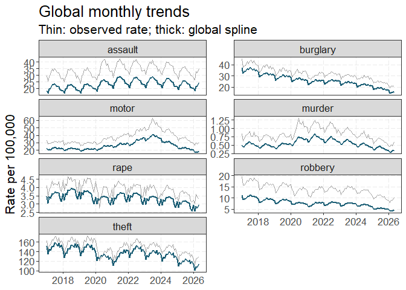
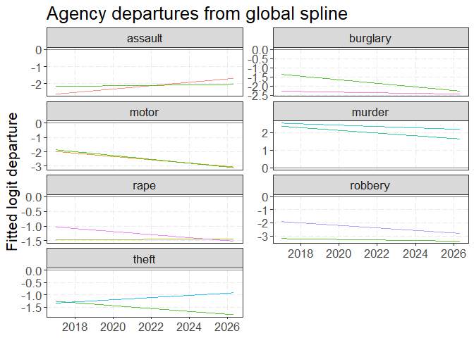
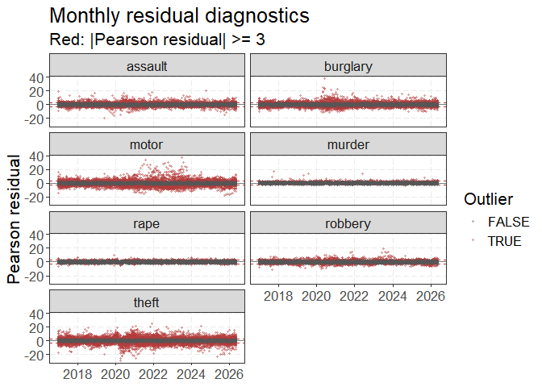

# A spline decomposition of monthly crime trends
Andrew P. Wheeler

# Overview

This paper develops a first-pass seasonal-trend decomposition for
monthly crime counts observed across agencies. The motivating idea is
the aggregated logit-binomial model used by Wheeler and Kovandzic
(Wheeler and Kovandzic 2018), extended so that the time structure is
estimated with smooth functions. The goal is descriptive: identify the
common curve for each crime type, measure agency departures from that
curve, and flag unusually large monthly residuals.

The source snapshot comes from the Real-Time Crime Index repository
(AH-Datalytics 2026). The initial fit uses component crimes rather than
aggregate violent and property totals, which prevents the same component
offenses from entering the stacked model twice.

# Data and model

The analysis uses monthly agency-level counts for murder, rape, robbery,
assault, burglary, theft, and motor-vehicle theft. Rows are restricted
to the published `size == all` sample, the current population threshold,
and valid counts. The current fit uses a minimum population of 250,000
and contains 75,813 stacked agency-month-crime observations from 100
agencies.

For agency (i), crime type (c), and month (t), let (Y\_{ict}) be the
reported count and (N\_{it}) the agency population. The response is

$$
Y_{ict} \sim \operatorname{Binomial}(N_{it}, p_{ict}), \qquad
\operatorname{logit}(p_{ict}) = \eta_{ict}.
$$

The linear predictor is

$$
\eta_{ict} = \alpha_c + f_c(\text{time}_{t}) + g_c(\text{year}_{t})
  + h_c(\text{month}_{t}) + b_i + b_{ic} + q_{ic}(\text{time}_{t}) + r_{ict}.
$$

Here (f_c) is the crime-specific global time curve, (g_c) is a smooth
year term, and (h_c) is a cyclic cubic spline for month. Agency and
agency-by-crime random effects provide partial pooling. The regularized
agency-by-crime random time slope (q\_{ic}) estimates a persistent
departure from the global curve. The optional agency-month term
(r\_{it}), shared across the stacked crime types, is the overdispersion
term analogous to the `(1|Row)` term in the motivating model. The published
deliverable fit leaves this term off for runtime on the full sample; focused
runs can enable it with `--overdispersion=true`.

The global baseline is obtained by predicting with agency and
observation terms excluded. Agency departures are the difference between
the retained agency prediction and this baseline on the logit scale. A
monthly observation is flagged when its absolute Pearson residual is at
least 3; this threshold is an exploratory screening rule, not a
multiple-testing-adjusted hypothesis test.

# Global trends

The thick curves are the population-weighted global spline predictions.
The thin curves show the corresponding observed rates. This view
separates the slowly evolving crime-specific baseline from
month-to-month noise without interpreting every local peak as a
structural break.

# Agency departures

The figure displays agencies with the largest absolute fitted departures
for each crime type. A positive value means that the agency’s fitted
rate is above the global crime-specific curve on the logit scale. The
agency smooths are regularized, so short isolated spikes are not
automatically converted into a new long-run trend.

# Residual screening

Residual screening is available at both the month and curve levels. The
browser app can filter a selected agency and crime type, change the date
window, and change the residual threshold. This makes it possible to
inspect whether a flagged month is isolated, part of a run, or aligned
with a broader departure in the agency curve.

# Limitations and next steps

The source data are reported crime counts and may contain missing
reporting, changes in agency coverage, and revisions. The current
denominator is the published population field; it is treated as the
binomial number of trials for this first implementation. The model is
descriptive and does not identify causal effects. In particular, the
time spline, year spline, seasonality, and agency smooths should be
interpreted together rather than as independent causal components.

Next steps are to add reporting-completeness diagnostics, compare
alternative denominators and quasi-binomial formulations, study
sensitivity to population thresholds, and automate a pinned monthly
update workflow. The supplied Wheeler paper and spline discussion by
Simpson provide useful guidance for prediction intervals and comparisons
between smooths (Wheeler and Kovandzic 2018; Simpson 2017).

AH-Datalytics. 2026. “Real-Time Crime Index Repository.”
<https://github.com/AH-Datalytics/rtci>.

Simpson, Gavin L. 2017. “Difference Splines i.” From the bottom of the
heap.
<https://fromthebottomoftheheap.net/2017/10/11/difference-splines-i/>.

Wheeler, Andrew P., and Tomislav V. Kovandzic. 2018. “Monitoring
Volatile Homicide Trends Across US Cities.” *Homicide Studies* 22 (2):
119–44.

