# Monthly crime trends: global patterns and city departures
Andrew P. Wheeler

# Abstract

Crime trends are commonly summarized by national aggregates or short-term
percentage changes, both of which can obscure sustained local departures and
overstate ordinary variation. This paper decomposes monthly reported crime
from the Real-Time Crime Index into a global nonlinear trend, recurring annual
seasonality, calendar-month shocks shared across cities, city-specific trend
and seasonal departures, and city-month residual variation. Explore the results
at https://apwheele.github.io/CrimeDecomp/app/ and reproduce the analysis at
https://github.com/apwheele/CrimeDecomp.

# Introduction

Crime trends are often summarized with two numbers and a percent change.
That is convenient, but it makes normal volatility look important and
hides whether a change is temporary or sustained. Prior work has shown
how time-series graphs, prediction intervals, and fan charts give a more
honest picture of crime trends than binary before-and-after comparisons
([Wheeler 2016](#ref-wheeler2016); [Wheeler and Kovandzic
2018](#ref-wheeler2018); [Yim, Riddell, and Wheeler
2020](#ref-yim2020)). Those tools answer whether a recent observation is
unusual. Here I address a related question: *what part of a city’s
change is shared with other cities, and what part is local?*

There are at least three patterns worth separating. Crime can follow a
gradual trend shared across the country, a city can have a persistently
different trajectory or seasonal pattern, and an individual month can
depart sharply from both. Lumping those patterns into one residual term
makes a short-lived spike look like a new trend (or smooths away a local
trend that is actually different).

I use monthly reported crime from the Real-Time Crime Index (RTCI) ([AH
Datalytics 2026](#ref-rtci)) and fit a hierarchical binomial model
separately for 7 offenses. The model has a smooth trend and seasonal
pattern shared across the sample, but it also gives every city its own
partially pooled trend and season. Two additional terms separate monthly
movement shared by all cities from the remaining city-month variation.

The goal is descriptive. The model provides a practical way to compare
the national pattern, sustained city departures, and unusual months. It
is not a test of why crime changed, and it is not a forecasting model.

# Data and rate construction

I use 465,985 city-month-offense observations from 590 RTCI cities,
covering 7 offenses from January 2017 through June 2026. I do not impose
a population threshold. For the figures, a monthly count $Y$ and
population $N$ are displayed as $12(Y/N)100{,}000$. This is an
annualized rate per 100,000: it preserves the observed monthly count but
puts cities on a familiar scale.

The upstream files used for this build were downloaded on August 21,
2026 at 16:31 UTC. Before rendering, the workflow checks the current
RTCI file revisions and atomically replaces only source files whose
contents changed. A content-signature change triggers the sequential
model workflow; otherwise the validated checkpoints are reused. Exact
upstream revisions and local checksums are stored with the source
metadata and city crosswalk. This keeps the paper and application
reproducible while separating reported counts from model-generated
output. Data preparation uses R and the tidyverse ([R Core Team
2026](#ref-R2026); [Wickham et al. 2019](#ref-tidyverse2019)).

# Model

The practical goal is to distinguish level, trend, season, common
monthly movement, and local monthly noise. I fit a separate
aggregated-binomial generalized linear mixed model for each offense.
This is equivalent to a stacked model with no coefficients shared across
offenses, but it avoids building all 7 random-effect systems at the same
time. For city $i$ in month $t$,

```math
Y_{it} \sim \mathrm{Binomial}(N_{it},p_{it}),
```
```math
\mathrm{logit}(p_{it}) =
\alpha + \mathbf B(t)^\mathsf{T}\boldsymbol\beta
+ \mathbf F(m_t)^\mathsf{T}\boldsymbol\gamma
+ b_i + \mathbf B(t)^\mathsf{T}\mathbf u_i
+ \mathbf F(m_t)^\mathsf{T}\mathbf v_i + a_t + e_{it}.
```

The global intercept is $\alpha$. The vector $\mathbf B(t)$ contains
five natural cubic spline basis functions evaluated at time $t$, with
boundary and interior knots fixed from the complete analysis period. Its
fixed coefficients $\boldsymbol\beta$ define the smooth global long-run
trajectory. The vector $\mathbf F(m_t)$ contains sine and cosine pairs
for the first three annual harmonics; $\boldsymbol\gamma$ therefore
defines a smooth seasonal curve that joins continuously from December to
January. Natural cubic regression splines provide a low-rank
representation of gradual change, while paired Fourier terms provide a
direct cyclic representation of seasonality ([S. N. Wood
2017](#ref-wood2017)).

The city random intercept $b_i \sim N(0,\sigma_b^2)$ captures persistent
between-city differences in level. Each city also has its own
trend-basis coefficients $\mathbf u_i$ and seasonal-basis coefficients
$\mathbf v_i$:

```math
\mathbf u_i \sim N(\mathbf 0,\sigma_u^2\mathbf I_5), \qquad
\mathbf v_i \sim N(\mathbf 0,\sigma_v^2\mathbf I_6).
```

Thus the city trend is the global trend plus
$\mathbf B(t)^\mathsf{T}\mathbf u_i$, and the city seasonal curve is the
global seasonal curve plus $\mathbf F(m_t)^\mathsf{T}\mathbf v_i$. These
are the city-varying smooth terms: partial pooling shrinks weakly
supported departures toward the global curves instead of fitting an
unrelated curve to every city. This global-plus-deviation construction
follows the logic of factor-smooth comparisons described by Simpson
([2017](#ref-simpson2017)) and hierarchical GAMs more generally
([Pedersen et al. 2019](#ref-pedersen2019)), implemented here through
explicit low-rank random coefficients.

The time-period intercept $a_t \sim N(0,\sigma_a^2)$ is shared by all
cities observed in month $t$. It captures nonsmooth national monthly
departures after the global trend and cyclic seasonal curve have been
fitted. The final term is an observation-level random effect,
$e_{it} \sim N(0,\sigma_e^2)$, unique to city $i$ in month $t$. It
accommodates extra-binomial variation without changing the binomial
response distribution. The distinction matters. The term $a_t$ moves
every city in a given month, whereas $e_{it}$ belongs to one city and
one month.

In the fitted `glmmTMB` model, the corresponding computational
specification is

``` r
cbind(count, trials - count) ~ 1 +
  trend_b1 + ... + trend_b5 +
  season_s1 + season_c1 + ... + season_s3 + season_c3 +
  (1 | city_id) + (1 | time_period) +
  homdiag(0 + trend_b1 + ... + trend_b5 | city_trend_group) +
  homdiag(0 + season_s1 + ... + season_c3 | city_season_group) +
  (1 | cell_id)
```

Here `homdiag` assigns one estimated variance to all coefficients in a
basis block, sets their correlations to zero, and allows the
coefficients to vary by city. Despite their names, `city_trend_group`
and `city_season_group` do not combine cities into artificial groups.
Each is a one-to-one copy of `city_id` with the same 590 levels. The
copies let `glmmTMB` represent the city intercept, city trend
coefficients, and city seasonal coefficients as three independent
covariance blocks; every city still receives its own five trend and six
seasonal coefficients. `homdiag` is a parsimonious ridge penalty:
replacing it with `diag` would estimate a separate variance for each
basis coefficient, while an unstructured block would also estimate their
correlations. The homogeneous assumption is computationally stable but
depends on the scaling of the chosen basis. The natural-spline knots and
boundary knots are cached with each fitted object, as are the three
seasonal harmonics, so later predictions use exactly the estimation
bases. Models are estimated by restricted maximum likelihood with
`glmmTMB`, whose Template Model Builder backend uses automatic
differentiation and sparse random-effect calculations ([Brooks et al.
2017](#ref-brooks2017); [Kristensen et al. 2016](#ref-kristensen2016)).
Each complete fitted model is saved and reload-verified before the next
offense begins.

Predictions are reported at four levels. The global curve contains the
intercept and fixed trend and seasonal basis terms. The city curve
additionally contains $b_i+\mathbf B(t)^\mathsf{T}\mathbf u_i+
\mathbf F(m_t)^\mathsf{T}\mathbf v_i$. The shared time-period remainder
adds $a_t$, and the final fitted value adds $e_{it}$. There is no
continuity correction or constructed “stabilized probability”; zeros are
valid binomial outcomes and all displayed components come directly from
the fitted model.

## Computational implementation

I first implemented the model with `mgcv` factor smooths through
`gamm4`: global thin-plate and cyclic smooths were combined with
city-specific `fs` trend and seasonal smooths, while `lme4` represented
the city, time-period, and observation-level intercepts ([S. N. Wood
2011](#ref-wood2011), [2017](#ref-wood2017); [S. Wood and Scheipl
2025](#ref-gamm4); [Bates et al. 2015](#ref-bates2015)). That model
worked on reduced sets of cities and years. The full offense data were a
different problem. Linux runs used more than 20 GB of memory before
completing, and Windows runs repeatedly terminated inside the sparse
`Matrix` factorization. A model that works only on a large rented
machine is not a useful default for this project.

The final implementation retains the structure that motivated the
factor-smooth model—a global intercept, global trend and season, city
random intercepts, city-varying trend and season, a common month effect,
and an observation-level effect—but changes its computational
representation. The explicit five-column natural-spline and six-column
Fourier bases make the size of each city’s coefficient block fixed and
transparent. Fitting those blocks with `glmmTMB` reduced the full model
to a sparse random-coefficient problem that could be estimated and
reload-verified one offense at a time. This is not a general claim that
`mgcv` factor smooths are infeasible. It is a practical result for this
combination of 590 cities, 465,985 city-month-offense observations, two
city-varying bases, and an observation-level random effect.

# Global trends

<a href="#fig-global-trend" class="quarto-xref">Figure 1</a> shows the
gradual change shared across cities after removing seasonal,
city-specific, and monthly variation. I use a separate vertical scale
for each offense; otherwise property crime would flatten the lower-rate
murder and rape series. Figures are produced with `ggplot2` ([Wickham
2016](#ref-wickham2016)). From January 2017 through June 2026, the
fitted burglary trend declined by 62.7%, robbery by 57.0%, murder by
37.6%, and theft by 33.0%. Assault was the exception: its fitted global
trend ended 7.9% above its January 2017 level. These endpoint
comparisons summarize the curves; they are not causal estimates. The
paths between the endpoints are more useful than the percentage alone.

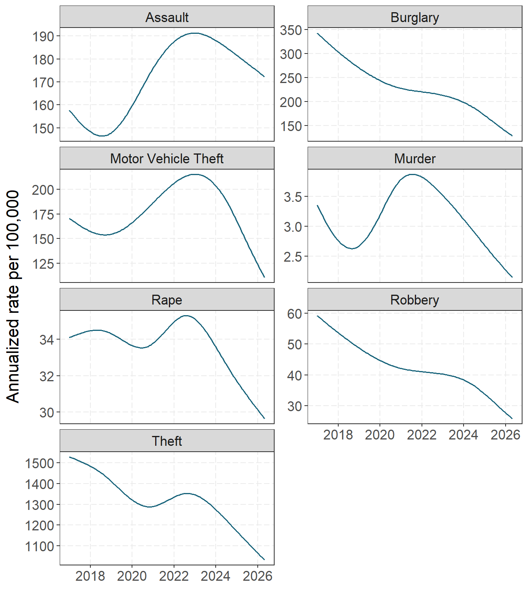
# Global seasonal patterns

<a href="#fig-global-seasonal" class="quarto-xref">Figure 2</a> answers
a simple question: after accounting for the long-run trend, which months
tend to be higher or lower? Values above zero are months above the
fitted trend, and values below zero are months below it. The effect is
displayed on the annualized rate scale, so its magnitude depends on the
baseline rate for the offense as well as the logit-scale seasonal curve.

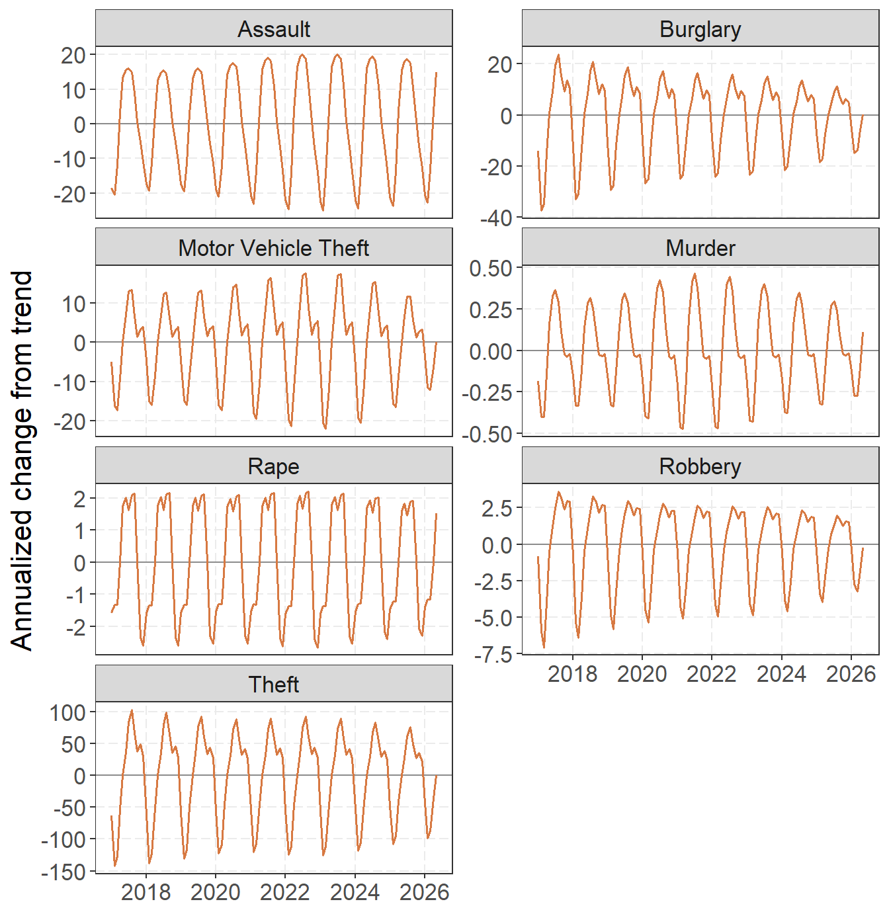
# Shared time period variation

<a href="#fig-global-residual" class="quarto-xref">Figure 3</a> shows
the fitted common time-period effect $a_t$. I transform it from the
logit scale to a change in the annualized global rate. This isolates
monthly movement shared across the sample after accounting for trend and
season; it does not include the city-specific effect $e_{it}$. A
positive monthly effect can therefore occur during a declining trend
whenever that month is above its still-declining baseline.

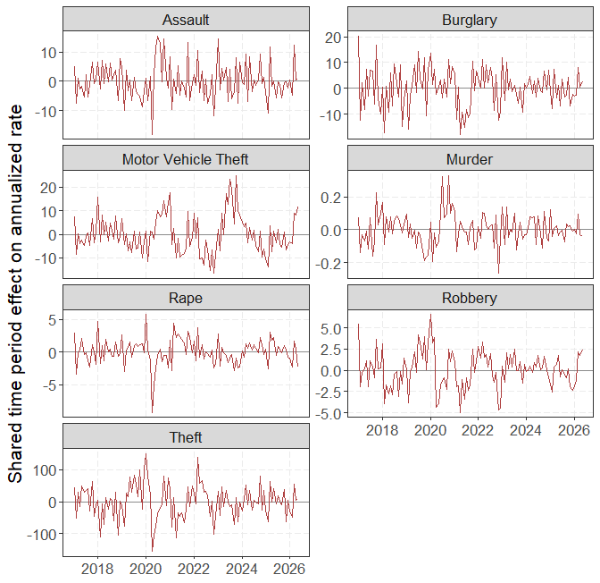

The common time-period term separates abrupt movement from gradual
change. April 2020 is a prominent negative departure for rape, assault,
and theft; motor vehicle theft has a large positive shared departure in
October 2023. Their timing does not identify a cause.

# A city example: Philadelphia

## Robbery

Philadelphia robbery illustrates what each layer adds. The global curve
is the robbery pattern shared across the sample. The city curve adds
Philadelphia’s level, trend, and seasonal departures. The observed
series is much noisier because it also includes shared monthly movement
and the Philadelphia-specific city-month residual.

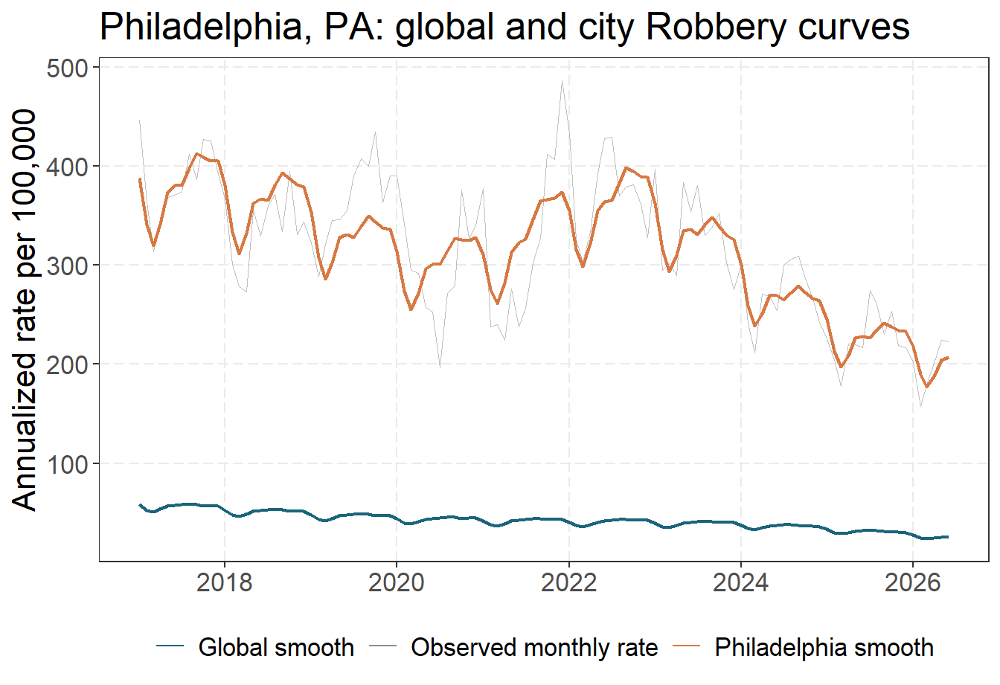

Across the series, Philadelphia’s fitted city curve differs from the
global curve by an average of 2.01 on the logit scale. That average
includes the city intercept. The departure ranges from 1.84 in March
2017 to 2.23 in October 2022; movement within that range reflects the
city-specific trend and seasonal deviations. The largest fitted monthly
row residual occurs in July 2020. It is not folded back into either
smooth curve, which keeps an unusual month from being mistaken for a
persistent local trajectory.
<a href="#fig-city-components" class="quarto-xref">Figure 4</a> compares
like components directly. The trend panel removes intercepts and centers
both curves, so it compares shape rather than level. The seasonal panel
superimposes Philadelphia’s fitted seasonal pattern on the global
pattern. The residual panel compares the time-period effect shared by
the full sample with Philadelphia’s total monthly residual,
$a_t+e_{it}$. Shaded ribbons around the Philadelphia trend and seasonal
curves are approximate 95% pointwise conditional intervals for the
city-specific coefficient deviations.

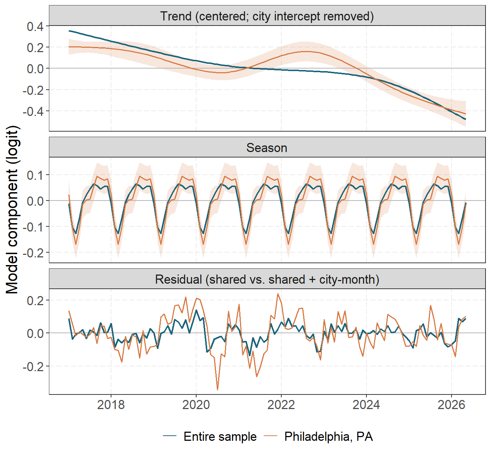
## Burglary

Philadelphia burglary provides a useful contrast because several abrupt
2020 changes are visible in the reported series but should not be
absorbed into the city’s long-run trend. In the RTCI source snapshot
downloaded on August 21, 2026 at 16:31 UTC, Philadelphia reported 722
burglaries in May, 1,347 in June, and 986 in October 2020. Those counts
correspond to annualized monthly rates of 554.5, 1034.6, and 757.3 per
100,000, respectively. These values are calculated directly from RTCI’s
reported count and population fields, rather than from a model-generated
artifact.

<a href="#fig-philly-burglary-rate" class="quarto-xref">Figure 5</a>
shows that the partially pooled city curve remains smooth through these
spikes. This is intentional: the smooth trend and season describe
persistent structure, while isolated city-month departures belong to the
residual term. The largest fitted Philadelphia burglary row residual
occurs in June 2020.

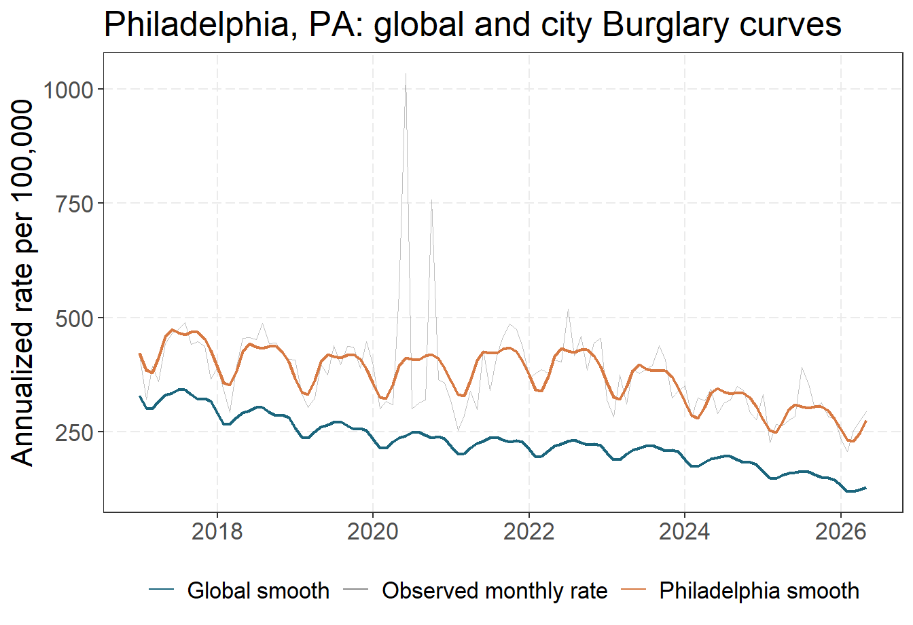
<a href="#fig-philly-burglary-components"
class="quarto-xref">Figure 6</a> separates the same series into trend,
season, and residual components. The centered trend panel removes
Philadelphia’s city intercept; the seasonal panel compares like Fourier
components; and the bottom panel shows how the city-month term isolates
the abrupt burglary departures from the residual movement shared by the
national sample.

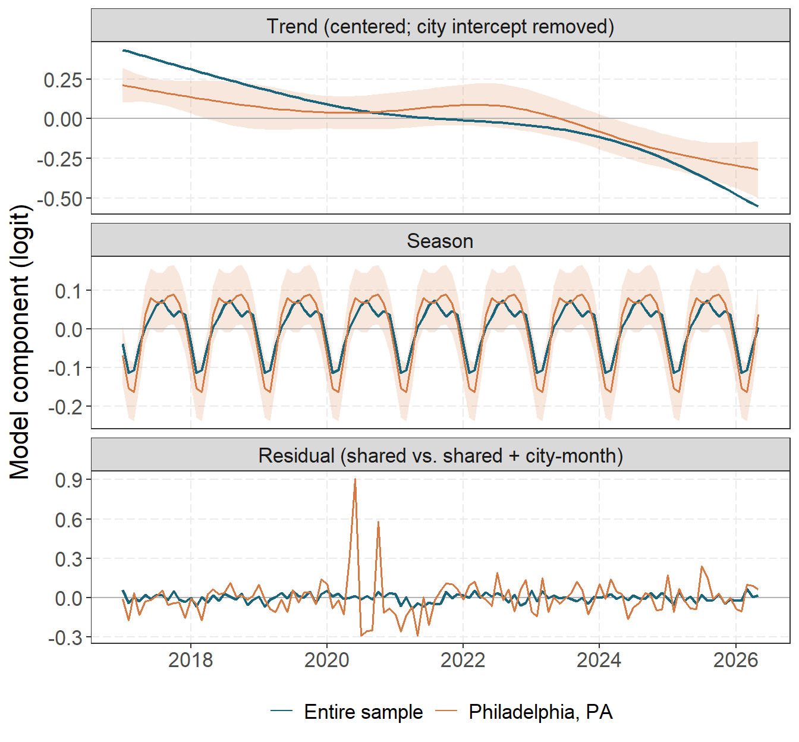
# Cities with unusually different trends

A large city intercept only says that a city has a different average
level. It does not show that the city is moving in a different
direction. To find unusual trend shapes, I center each city’s spline
departure over time and summarize it with its root-mean-square (RMS)
magnitude. City-offense pairs with fewer than 60 months were excluded.
Log RMS was then standardized within each offense using its median and
median absolute deviation. Thus, every offense contributes its two most
unusual city trends, rather than allowing the largest deviations from
one offense to dominate the comparison. The ranking excludes city
intercepts, seasonal effects, shared time-period shocks, and
observation-level effects.

For each selected city, the conditional variances of its spline
coefficients were propagated through the centered trend basis. The
shaded region is the resulting estimate plus or minus 1.96 pointwise
standard errors. Because `glmmTMB` supplies diagonal conditional
variances for these `homdiag` blocks, the calculation omits posterior
covariance among basis coefficients and conditions on the fitted global
curve and variance parameters. The ribbons are therefore approximate
pointwise uncertainty intervals, not simultaneous bands or intervals for
a new city’s trajectory.

| Offense             | First city                            | Second city                               |
|:--------------------|:--------------------------------------|:------------------------------------------|
| Murder              | Portland, OR (RMS 0.289; score 3.31)  | Livingston, LA (RMS 0.250; score 2.97)    |
| Rape                | Paulding, GA (RMS 0.784; score 4.60)  | State College, PA (RMS 0.675; score 4.19) |
| Robbery             | Arlington, VA (RMS 0.562; score 4.15) | Vallejo, CA (RMS 0.394; score 3.13)       |
| Assault             | Scranton, PA (RMS 0.851; score 4.77)  | Murrieta, CA (RMS 0.577; score 3.71)      |
| Burglary            | Palatine, IL (RMS 0.551; score 3.90)  | Wright, MN (RMS 0.438; score 3.24)        |
| Theft               | Vallejo, CA (RMS 0.582; score 5.14)   | Upper Darby, PA (RMS 0.539; score 4.90)   |
| Motor Vehicle Theft | Tulare, CA (RMS 0.952; score 4.80)    | Burlington, VT (RMS 0.896; score 4.62)    |

Two cities with the largest standardized trend departures within each
offense. RMS is calculated on the centered logit-scale spline departure;
score is the within-offense robust standardized log RMS.

<a href="#fig-trend-outliers-a" class="quarto-xref">Figure 7</a> and
<a href="#fig-trend-outliers-b" class="quarto-xref">Figure 8</a> compare
each selected city’s centered trend with the corresponding global trend.
Centering removes both the global intercept and the city random
intercept, so separation between the lines represents trajectory rather
than average crime level.

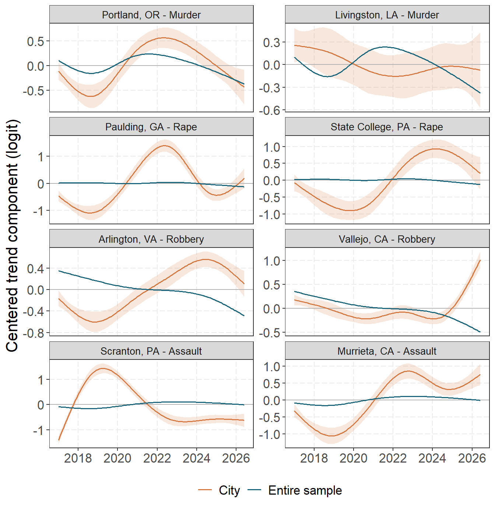
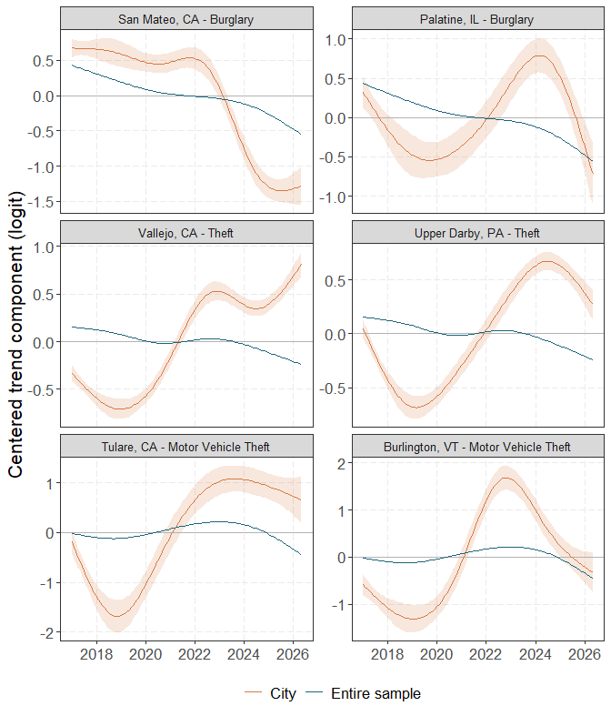
# Cities with different seasonal patterns

I rank seasonal departures separately from trend departures. For each
city-offense pair, I evaluate its six city-specific Fourier coefficients
over the 12 months and summarized by the RMS departure from the global
seasonal curve. Log RMS was standardized within offense by its median
and median absolute deviation. The two leading cities are retained
separately for every offense. This metric excludes city intercepts,
long-run trend departures, common monthly shocks, and observation-level
effects. Seasonal ribbons use the same diagonal conditional-variance
propagation through the centered Fourier basis and have the same
pointwise, conditional interpretation as the trend ribbons.

| Offense             | First city                              | Second city                                  |
|:--------------------|:----------------------------------------|:---------------------------------------------|
| Murder              | Chicago, IL (RMS 0.087; score 4.30)     | St Louis, MO (RMS 0.064; score 3.69)         |
| Rape                | Paulding, GA (RMS 0.054; score 4.31)    | Colorado Springs, CO (RMS 0.051; score 4.11) |
| Robbery             | Minneapolis, MN (RMS 0.108; score 4.17) | Prince George’s, MD (RMS 0.065; score 2.85)  |
| Assault             | Cincinnati, OH (RMS 0.065; score 3.79)  | Newark, NJ (RMS 0.053; score 3.09)           |
| Burglary            | Shawnee, KS (RMS 0.110; score 4.33)     | Minneapolis, MN (RMS 0.095; score 3.74)      |
| Theft               | Burlington, VT (RMS 0.118; score 4.33)  | Manchester, NH (RMS 0.080; score 3.06)       |
| Motor Vehicle Theft | Owensboro, KY (RMS 0.067; score 3.78)   | Kalamazoo, MI (RMS 0.063; score 3.53)        |

Two cities with the largest standardized seasonal departures within each
offense. RMS is calculated from the city-specific Fourier departure over
the 12 months; score is the within-offense robust standardized log RMS.

<a href="#fig-seasonal-outliers-a" class="quarto-xref">Figure 9</a> and
<a href="#fig-seasonal-outliers-b" class="quarto-xref">Figure 10</a>
superimpose every selected city’s fitted seasonal curve on the
corresponding offense-wide curve.

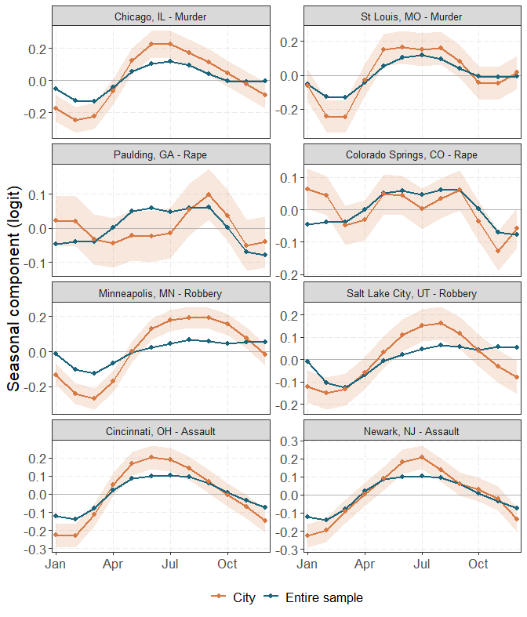
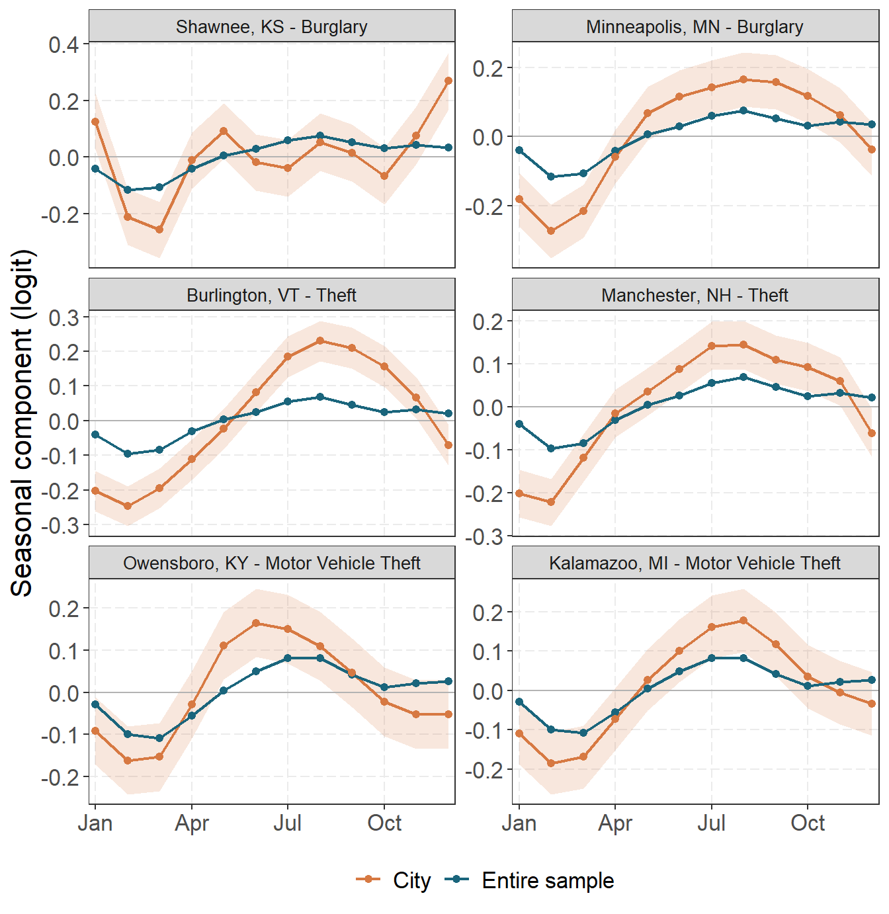
# Cities with unusually large monthly residuals

Trend and seasonal rankings describe persistent shapes. They are not
designed to identify one unusual month. For that task, I retain the
month with the largest absolute fitted observation-level effect
$|e_{it}|$ within each city and offense. I then select the two cities
with the largest values separately for each offense. Ranking one maximum
per city ensures that a single city cannot occupy both positions for an
offense. Because $e_{it}$ is on the common logit scale within each
offense, the ordering does not depend on city population or on
converting the effect to an annualized rate. It does, however, identify
fitted residual extremes rather than raw-count anomalies.

For each selected city-month,
<a href="#tbl-residual-outliers" class="quarto-xref">Table 1</a>
compares the observed outcome with the model-predicted mean before
adding $e_{it}$. The prediction therefore includes the city’s intercept,
trend, and seasonal terms plus the shared time-period effect, but not
the observation-level residual used to rank the city. Both observed and
predicted counts are monthly.

<div class="cell-output-display">

| Offense             | City                 | Month |  $e$ | Pred. n | Obs. n |
|:--------------------|:---------------------|:------|-----:|--------:|-------:|
| Murder              | Las Vegas, NV        | 10/17 | +1.0 |    13.6 |     71 |
| Murder              | San Antonio, TX      | 06/22 | +0.8 |    19.2 |     71 |
| Rape                | Bismarck, ND         | 05/25 | +0.6 |     4.7 |     39 |
| Rape                | Riverside, CA        | 12/19 | +0.5 |    11.7 |     45 |
| Robbery             | Washington, DC       | 07/23 | +0.6 |   253.8 |    475 |
| Robbery             | Indianapolis, IN     | 06/19 | -0.5 |   213.2 |     90 |
| Assault             | Bismarck, ND         | 05/25 | +1.3 |    14.9 |    101 |
| Assault             | Indianapolis, IN     | 06/19 | -1.2 |   468.0 |     96 |
| Burglary            | St. Clair Shores, MI | 12/24 | +2.1 |    10.2 |    129 |
| Burglary            | Bismarck, ND         | 05/25 | +1.9 |    18.4 |    165 |
| Theft               | Bismarck, ND         | 05/25 | +1.7 |   130.8 |    772 |
| Theft               | Lubbock, TX          | 10/17 | -1.6 |   682.5 |     39 |
| Motor Vehicle Theft | Washoe, NV           | 06/17 | +1.6 |    12.1 |    105 |
| Motor Vehicle Theft | Bismarck, ND         | 05/25 | +1.6 |    15.1 |    114 |

</div>

Bismarck, North Dakota appears for five different offenses in May 2025,
with each observed count far above its model-predicted mean. That
synchronized cross-offense pattern is more consistent with a reporting
or data-processing issue than with simultaneous spikes in five distinct
crime types. These rows should therefore be treated as a data-quality
flag, not as evidence by themselves of a sudden broad-based increase in
crime.

<a href="#fig-residual-outliers-a" class="quarto-xref">Figure 11</a> and
<a href="#fig-residual-outliers-b" class="quarto-xref">Figure 12</a>
show the complete city-month residual series for each selected city,
with the ranked month marked in red. These plots exclude the global
trend, global season, city intercept, city-specific trend and season,
and shared time-period effect. Their vertical scales are symmetric
around zero within each panel so positive and negative departures can be
compared directly.

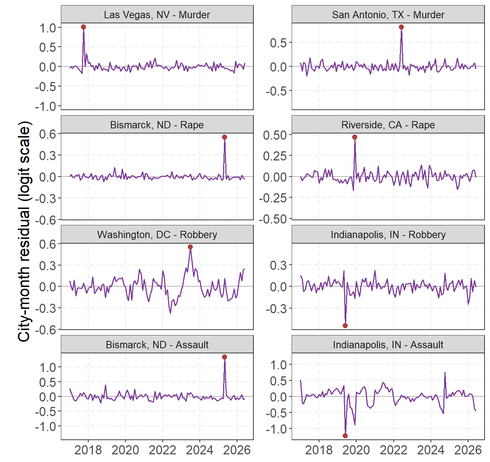
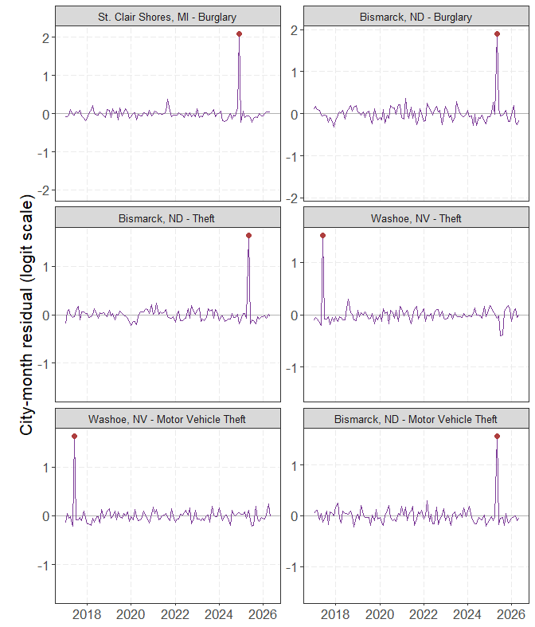
# Most recent month residual outliers

The preceding ranking asks which cities had the most unusual fitted
month at any point in the series. For a current monitoring question, I
instead restrict the comparison to the latest available observation
within each offense. All 7 offenses currently end in June 2026. Within
that single monthly cross-section, I rank cities by the absolute fitted
observation-level effect $|e_{it}|$ and retain the two largest values
for each offense. This identifies the clearest recent local departures
after removing the global and city-specific trends, seasonal terms, city
intercept, and shared time-period effect. The ranking is descriptive: it
does not attach a separate hypothesis test to each city or account for
revisions to the most recent data.

For each selected city,
<a href="#tbl-latest-residual-outliers" class="quarto-xref">Table 2</a>
compares the observed outcome with the model-predicted mean before
adding $e_{it}$. The prediction therefore includes the city’s intercept,
trend, and seasonal terms plus the shared time-period effect, but not
the observation-level residual used to rank the city. Counts are
monthly. Rates are annualized from that month’s count or fitted mean and
expressed per 100,000 residents. The reported standard error for
$e_{it}$ is the conditional standard deviation of the fitted random
effect, holding the estimated fixed effects and variance parameters
fixed. It describes uncertainty after partial pooling and is not a
standard error for the raw observed-minus-predicted difference.

<div class="cell-output-display">

| Offense             | City             |   $e$ | SE($e$) | Pred. n | Obs. n | Pred. rate | Obs. rate |
|:--------------------|:-----------------|------:|--------:|--------:|-------:|-----------:|----------:|
| Murder              | Philadelphia, PA | +0.23 |    0.14 |    17.0 |     29 |       13.1 |      22.3 |
| Murder              | Vallejo, CA      | +0.14 |    0.17 |     1.9 |      7 |       19.0 |      68.4 |
| Rape                | Nashville, TN    | -0.15 |    0.11 |    37.8 |     24 |       63.1 |      40.1 |
| Rape                | Hidalgo, TX      | +0.14 |    0.12 |     9.1 |     18 |       41.9 |      83.0 |
| Robbery             | Milwaukee, WI    | -0.28 |    0.10 |    80.5 |     43 |      172.5 |      92.2 |
| Robbery             | Washington, DC   | +0.24 |    0.09 |    89.0 |    129 |      153.9 |     223.2 |
| Assault             | Houston, TX      | -0.58 |    0.08 |   893.3 |    482 |      444.1 |     239.6 |
| Assault             | Indianapolis, IN | -0.46 |    0.09 |   328.8 |    192 |      436.6 |     255.0 |
| Burglary            | Collierville, TN | +1.04 |    0.17 |     6.2 |     41 |      142.6 |     944.2 |
| Burglary            | Pasadena, TX     | +1.02 |    0.13 |    33.6 |    116 |      269.9 |     933.2 |
| Theft               | Milwaukee, WI    | -0.49 |    0.07 |   510.4 |    284 |     1094.2 |     608.9 |
| Theft               | San Diego, CA    | +0.39 |    0.06 |  1355.8 |  2,021 |     1154.3 |    1720.7 |
| Motor Vehicle Theft | Milwaukee, WI    | -0.96 |    0.11 |   352.3 |    110 |      755.2 |     235.8 |
| Motor Vehicle Theft | Omaha, NE        | +0.63 |    0.10 |   134.2 |    268 |      329.6 |     658.5 |

</div>

<a href="#fig-latest-residual-outliers-a"
class="quarto-xref">Figure 13</a> and
<a href="#fig-latest-residual-outliers-b"
class="quarto-xref">Figure 14</a> retain each selected city’s full
residual history for context, while the red point marks the latest
observation used in the ranking. Consequently, earlier residuals shown
in these panels do not influence which cities were selected.

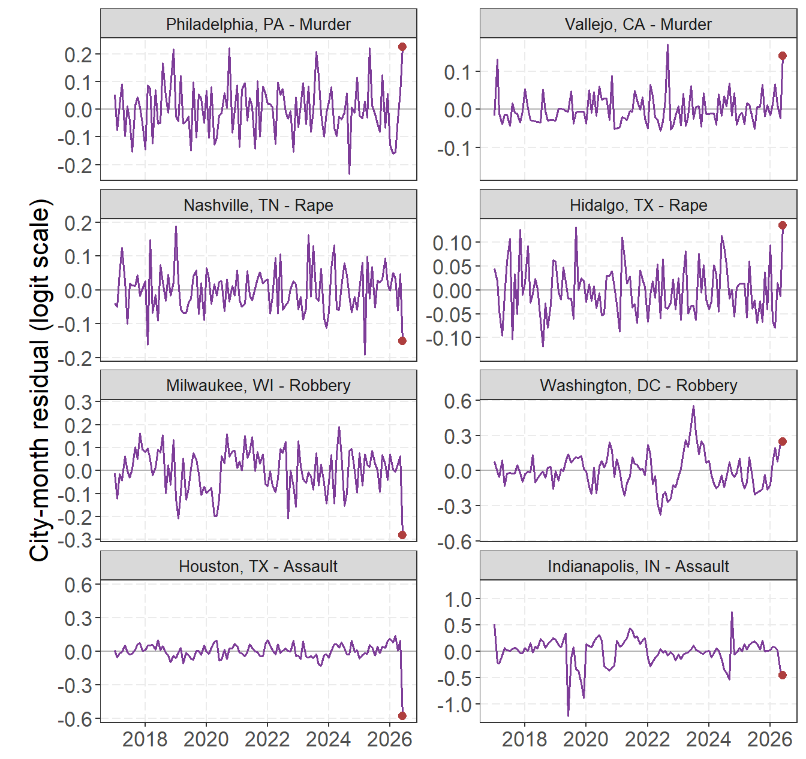
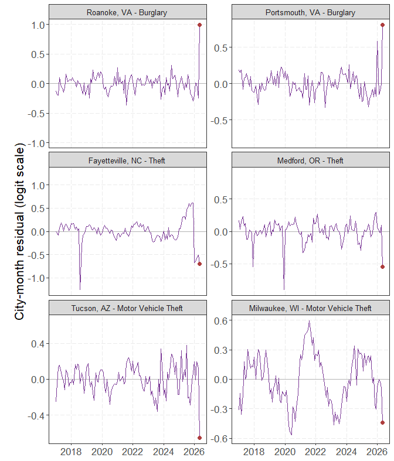

# Interactive web application

The [live web application](https://apwheele.github.io/CrimeDecomp/app/)
turns the saved decomposition into an exploratory companion to the
paper. Its overview page shows the global trend, seasonal pattern, and
shared monthly effect for each offense. The city page filters
jurisdictions by state and then compares a selected city’s observed and
fitted rates with the US-wide and local trend, seasonal, and residual
components. The all-city page displays every city’s centered trend and
seasonal curve and its observation-level monthly residuals; hovering
identifies individual cities, while a shaded band summarizes the middle
80% of city curves.

The demonstrations below are the same animations shown in the [companion
blog post](https://crimede-coder.com/blogposts/2026/CrimeTrends). In the
Word and Markdown versions they are embedded as animated GIFs; in the
PDF, each caption links to the corresponding animation.

<figure>

<figcaption>
City detail: selecting Philadelphia burglary and comparing observed,
global, city-specific, and residual patterns.
</figcaption>
</figure>
<figure>

<figcaption>
All-city curves: exploring national and city-level trends and
identifying jurisdictions with distinctive trajectories.
</figcaption>
</figure>
<figure>

<figcaption>
Monthly residuals: examining city-month departures around zero and
identifying observations that merit follow-up.
</figcaption>
</figure>

The complete source, app code, and reproducible workflow are maintained
in the [GitHub repository](https://github.com/apwheele/CrimeDecomp). The
[live web application](https://apwheele.github.io/CrimeDecomp/app/) and
the [GitHub-rendered Markdown
paper](https://github.com/apwheele/CrimeDecomp/blob/main/paper.md) will
be updated when the RTCI data are updated.

# Discussion

The main lesson is to avoid forcing every change into one story. The
global smooth describes movement shared across the sample. A changing
gap between a city and that smooth indicates a different local
trajectory. The residual term then identifies months that neither smooth
explains. Philadelphia burglary in 2020 is a clear example: June and
October are important observations, but they should not redefine the
city’s long-run curve.

This distinction extends the practical monitoring argument in my earlier
work. Percent changes can make ordinary low-count variation look
dramatic, while a single national series can hide substantial
differences among cities ([Wheeler 2016](#ref-wheeler2016); [Wheeler and
Kovandzic 2018](#ref-wheeler2018)). Fan charts address uncertainty
around a forecast ([Yim, Riddell, and Wheeler 2020](#ref-yim2020)). The
present model instead separates smooth common movement, sustained city
departures, and local monthly residuals. These are complementary tasks,
not competing definitions of a crime trend.

Partial pooling is what makes the city comparisons useful. If I
estimated an unconstrained curve for every city, the noisiest series
would tend to look the most distinctive. The shared variance parameters
let well-supported city patterns depart from the global curve while
pulling unstable patterns toward it ([Pedersen et al.
2019](#ref-pedersen2019); [Simpson 2017](#ref-simpson2017)). This is
especially important when comparing 590 cities with very different
populations and crime counts.

A useful future extension would turn the residual screen into a formal
multiple-testing procedure. For each city-month effect, one could
calculate a standardized statistic from $e_{it}$ and its conditional
standard error, convert that statistic to a two-sided p-value, and then
apply a false discovery rate (FDR) correction across a prespecified
family of cities and offenses. This would address the fact that, when
hundreds of cities are screened at once, some apparently unusual
residuals will occur by chance. Similar multiplicity issues arise when
the spatial point pattern test is used to identify local differences
across many areas; my prior work examined corrected local proportion
tests, and the Buffalo shooting analysis applied an FDR correction to
the local spatial comparisons ([Wheeler, Steenbeek, and Andresen
2018](#ref-wheeler2018sppt); [Drake et al. 2023](#ref-drake2023);
[Benjamini and Hochberg 1995](#ref-benjamini1995)). Because the proposed
tests would use shrunken random-effect estimates rather than independent
raw contrasts, their calibration should first be checked with simulation
or a parametric bootstrap.

The results are not causal effects or forecasts. Reported crime depends
on reporting practices, agency participation, revisions, and population
denominators. The binomial model gives counts and population a coherent
link, but it does not mean that residents have independent and identical
risks. The observation-level random effect accommodates extra variation;
it does not tell us why a particular month is unusual. I therefore view
the estimates as a monitoring and comparison tool. They show where to
look next, not what caused the pattern.

# Reproducibility and acknowledgments

The code, paper text, and web application were generated entirely
through prompting OpenAI Codex using Luna and Sol, with substantive
review and direction from the author. Generated metadata records the
exact model formulas and settings, and source data are cached in the
repository.

# References

<div id="refs" class="references csl-bib-body hanging-indent"
entry-spacing="0">

<div id="ref-rtci" class="csl-entry">

AH Datalytics. 2026. “Real-Time Crime Index: Reported Crime Trends
Data.” <https://github.com/AH-Datalytics/rtci>.

</div>

<div id="ref-bates2015" class="csl-entry">

Bates, Douglas, Martin Mächler, Ben Bolker, and Steve Walker. 2015.
“Fitting Linear Mixed-Effects Models Using Lme4.” *Journal of
Statistical Software* 67 (1): 1–48.
<https://doi.org/10.18637/jss.v067.i01>.

</div>

<div id="ref-benjamini1995" class="csl-entry">

Benjamini, Yoav, and Yosef Hochberg. 1995. “Controlling the False
Discovery Rate: A Practical and Powerful Approach to Multiple Testing.”
*Journal of the Royal Statistical Society: Series B (Methodological)* 57
(1): 289–300. <https://doi.org/10.1111/j.2517-6161.1995.tb02031.x>.

</div>

<div id="ref-brooks2017" class="csl-entry">

Brooks, Mollie E., Kasper Kristensen, Koen J. van Benthem, Arni
Magnusson, Casper W. Berg, Anders Nielsen, Hans J. Skaug, Martin
Mächler, and Benjamin M. Bolker. 2017. “glmmTMB Balances Speed and
Flexibility Among Packages for Zero-Inflated Generalized Linear Mixed
Modeling.” *The R Journal* 9 (2): 378–400.
<https://doi.org/10.32614/RJ-2017-066>.

</div>

<div id="ref-drake2023" class="csl-entry">

Drake, Gregory, Andrew P. Wheeler, Dae-Young Kim, Scott W. Phillips, and
Kathryn Mendolera. 2023. “The Impact of COVID-19 on the Spatial
Distribution of Shooting Violence in Buffalo, NY.” *Journal of
Experimental Criminology* 19 (2): 513–30.
<https://doi.org/10.1007/s11292-021-09497-4>.

</div>

<div id="ref-kristensen2016" class="csl-entry">

Kristensen, Kasper, Anders Nielsen, Casper W. Berg, Hans Skaug, and
Bradley M. Bell. 2016. “TMB: Automatic Differentiation and Laplace
Approximation.” *Journal of Statistical Software* 70 (5): 1–21.
<https://doi.org/10.18637/jss.v070.i05>.

</div>

<div id="ref-pedersen2019" class="csl-entry">

Pedersen, Eric J., David L. Miller, Gavin L. Simpson, and Noam Ross.
2019. “Hierarchical Generalized Additive Models in Ecology: An
Introduction with Mgcv.” *PeerJ* 7: e6876.
<https://doi.org/10.7717/peerj.6876>.

</div>

<div id="ref-R2026" class="csl-entry">

R Core Team. 2026. *R: A Language and Environment for Statistical
Computing*. Vienna, Austria: R Foundation for Statistical Computing.
<https://www.R-project.org/>.

</div>

<div id="ref-simpson2017" class="csl-entry">

Simpson, Gavin L. 2017. “Comparing Smooths in Factor-Smooth Interactions
i.”
<https://fromthebottomoftheheap.net/2017/10/11/difference-splines-i/>.

</div>

<div id="ref-wheeler2016" class="csl-entry">

Wheeler, Andrew P. 2016. “Tables and Graphs for Monitoring Temporal
Crime Trends: Translating Theory into Practical Crime Analysis Advice.”
*International Journal of Police Science & Management* 18 (3): 159–72.
<https://doi.org/10.1177/1461355716642781>.

</div>

<div id="ref-wheeler2018" class="csl-entry">

Wheeler, Andrew P., and Tomislav V. Kovandzic. 2018. “Monitoring
Volatile Homicide Trends Across u.s. Cities.” *Homicide Studies* 22 (2):
119–44. <https://doi.org/10.1177/1088767917740171>.

</div>

<div id="ref-wheeler2018sppt" class="csl-entry">

Wheeler, Andrew P., Wouter Steenbeek, and Martin A. Andresen. 2018.
“Testing for Similarity in Area-Based Spatial Patterns: Alternative
Methods to Andresen’s Spatial Point Pattern Test.” *Transactions in GIS*
22 (3): 760–74. <https://doi.org/10.1111/tgis.12341>.

</div>

<div id="ref-wickham2016" class="csl-entry">

Wickham, Hadley. 2016. *Ggplot2: Elegant Graphics for Data Analysis*.
Springer-Verlag New York. <https://doi.org/10.1007/978-3-319-24277-4>.

</div>

<div id="ref-tidyverse2019" class="csl-entry">

Wickham, Hadley, Mara Averick, Jennifer Bryan, Winston Chang, Lucy
D’Agostino McGowan, Romain François, Garrett Grolemund, et al. 2019.
“Welcome to the Tidyverse.” *Journal of Open Source Software* 4 (43):
1686. <https://doi.org/10.21105/joss.01686>.

</div>

<div id="ref-wood2011" class="csl-entry">

Wood, Simon N. 2011. “Fast Stable Restricted Maximum Likelihood and
Marginal Likelihood Estimation of Semiparametric Generalized Linear
Models.” *Journal of the Royal Statistical Society: Series B* 73 (1):
3–36. <https://doi.org/10.1111/j.1467-9868.2010.00749.x>.

</div>

<div id="ref-wood2017" class="csl-entry">

———. 2017. *Generalized Additive Models: An Introduction with r*. 2nd
ed. Chapman; Hall/CRC.

</div>

<div id="ref-gamm4" class="csl-entry">

Wood, Simon, and Fabian Scheipl. 2025. *Gamm4: Generalized Additive
Mixed Models Using Mgcv and Lme4*.
<https://doi.org/10.32614/CRAN.package.gamm4>.

</div>

<div id="ref-yim2020" class="csl-entry">

Yim, Ha-Neul, Jordan R. Riddell, and Andrew P. Wheeler. 2020. “Is the
Recent Increase in National Homicide Abnormal? Testing the Application
of Fan Charts in Monitoring National Homicide Trends over Time.”
*Journal of Criminal Justice* 66: 101656.
<https://doi.org/10.1016/j.jcrimjus.2019.101656>.

</div>

</div>
